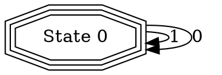

# FSMCONV
fsmconv is a command-line tool for converting FSA from one to another representation.

## Features

  1. Transform a NFA or an epsilon-NFA to a DFA
  2. **(in development)** Minimization of DFA
  3. **(in development)** Transform an epsilon-NFA to a NFA
  4. **(in development)** Unite many initial states of FSM to one in output FSM

## Installation

You can install it by the following commands:

```bash
git clone https://github.com/denis-korchagin95/fsmconv.git
cd fsmconv
sudo make install
```

You also can remove the program by the next command:

```bash
sudo make uninstall
```

If you don't want to install it to you user-space, you will use it locally by next command:

```bash
make build
./bin/fsmconv [arguments...]
```

## Language

It is a native language to be parsed by this program.

Each statement must be ends by semicolon character.

The rules of FSA have to be written by next format: `STATE to STATE by CHARACTERS` or `STATE -> STATE by CHARACTERS`. 
For example `q0 -> q1 by 'a'`.

To mark some states as initial or finished you can use directives 'initial' or 'final':

`initial q0;` or `final q1, q2;`

There is a special character that can be written by `@epsilon` to give the opportunity to write epsilon-NFA rules.

You can comment out some lines putting the `#` character at the beginning of the line.

Example:

```
# An nfa FSM example
initial A;
final B;

A to A by 'a', 'b';
A to B by 'b';
A to B by 'c', 'a';
B to C by @epsilon;
```

[The full grammar in BNF](./lang-grammar.txt)

## Usage

```
Usage: fsmconv file [options]

DESCRIPTION
        A command-line tool for converting FSA from one to another representation.

OPTIONS
        --print-only
                Print only the given FSM and exit.
        --format=[native|dot] (native by default)
                Print the FSM in a given format, where format can be one of 'native', or 'dot'.
        --output=<file>
                Place the output into <file>.
```

## Example

This command will print out an FSM in dot format.

```
fsmconv nfa.txt --format=dot
```

The output of this command may be:


